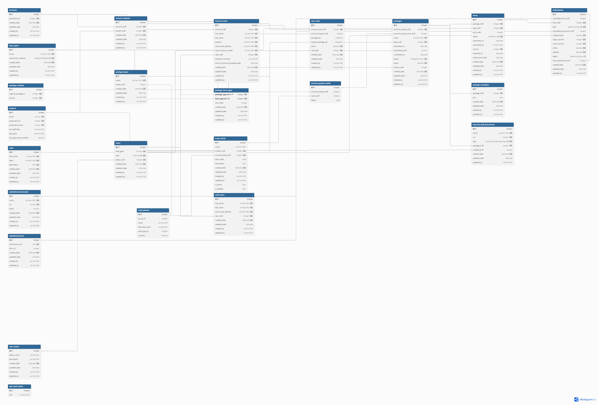

# Database Design: Works Integration

## Overview

This document describes the proposed database design changes to integrate **Works**, **Phases**, and **Milestones** into the EPIC Submit system. This enhancement enables the system to track work-specific packages and their associated phases, providing better organization and traceability for project submissions.

## New Tables Introduced

### 1. `track_works`
**Purpose**: Maintains a synchronized copy of work data from the EPIC.track application.

**Data Source**: This table is populated and kept in sync with EPIC.track via a scheduled cron job that calls the EPIC.track API. This is a read-only table.

**Significance**: 
- Provides local access to work information without direct dependency on EPIC.track availability
- This table can be used to track phase and work state changes

**Key Fields Synced from EPIC.track**:
- `id`: Work identifier (from EPIC.track)
- `project_id`: Associated project reference
- `current_phase_id`: Current phase of the work (references the phase in EPIC.track, not work_phase)
- `work_state`: Current state (e.g., "COMPLETED", "IN_PROGRESS")
- `title`: Work title
- `is_active`: Status flag
- `is_deleted`: Indicate if the work is deleted

**Note**: Work type information is accessible through the `current_phase` relationship (via `track_phases.work_type_id`).

**Sync Strategy**:
- Automated synchronization via cron job
- Calls EPIC.track API to fetch work data
- Updates local copy to maintain data consistency
- Key fields extracted: `project_id`, `current_phase_id` (from phase object), `work_state`

**Example Works from EPIC.track**:

The following table shows sample work data synced from EPIC.track:

| id | project_id | current_phase_id | work_state | title | is_active |
|----|------------|------------------|------------|-------|-----------|
| 90 | 106 (GCT Deltaport) | 2 (Early Engagement) | IN_PROGRESS | GCT Deltaport Expansion - Berth Four - Assessment | TRUE |
| 151 | 359 (Rocky Creek Coal) | 4 (Readiness Decision) | IN_PROGRESS | Rocky Creek Metallurgical Coal Project - Assessment | TRUE |
| 152 | 360 (Sample Project) | 9 (EAC Application Review) | IN_PROGRESS | Sample Project - Assessment | TRUE |
| 153 | 361 (Another Project) | 11 (Effects Assessment & Recommendation) | IN_PROGRESS | Another Project - Assessment | TRUE |
| 187 | 198 (Murray River Coal) | 74 (SubStart Decision) | COMPLETED | Murray River Coal - Substantial Start Determination | FALSE |
| 201 | 336 (Westcoast Connector) | 74 (SubStart Decision) | COMPLETED | Westcoast Connector Gas Transmission - Substantial Start | FALSE |
| 115 | 157 (Kootenay West Mine) | 60 (Complexity Decision) | IN_PROGRESS | Kootenay West Mine - Amendment - #04 | TRUE |
| 213 | 195 (Mt. Milligan) | 65 (Decision) | COMPLETED | Mt. Milligan Copper-Gold - Amendment - Long Term Water | FALSE |
| 91 | 239 (Town North Gas Plant) | 58 (Notification Decision) | COMPLETED | Town North Gas Plant - Project Notification | FALSE |
| 295 | 333 (WCOL NGL Recovery) | 32 (Minister's Designation Decision) | COMPLETED | WCOL Natural Gas Liquids (NGL) Recovery - Minister's Designation | FALSE |

**Work Type Reference**:
- **1** = Assessment (EA Certificate Request)
- **2** = Minister's Designation
- **7** = Amendment (EAC/Order Amendment)
- **10** = Substantial Start Determination

**Phase Reference** (see `track_phases` table for complete details):
- **2** = Early Engagement (Assessment) - Legislated, 90 days
- **4** = Readiness Decision (Assessment) - 60 days
- **9** = EAC Application Review (Assessment) - Legislated, 180 days
- **11** = Effects Assessment & Recommendation (Assessment) - Legislated, 150 days
- **32** = Minister's Designation Decision (Minister's Designation)
- **58** = Notification Decision (Project Notification)
- **60** = Complexity Decision (Amendment)
- **65** = Decision (Amendment)
- **74** = SubStart Decision (Substantial Start Determination)

**Notes**:
- `current_phase_id` references the `phase.id` from the nested phase object in the API response
- `work_state` values: "IN_PROGRESS", "COMPLETED", "SUSPENDED", "TERMINATED"
- `is_active` = FALSE typically indicates completed or closed works
- Each work is associated with a specific project and follows a defined phase workflow

### 2. `track_phases`
**Purpose**: Maintains a reference copy of phase definitions from EPIC.track.

**Data Source**: This table is populated with a one-time copy from EPIC.track and is **not automatically synchronized**.

**Significance**:
- Enables granular tracking of work progression through distinct phases
- Supports work-type-specific phase definitions (e.g., "Early Engagement" phase for Assessment work type)
- Provides flexibility for different work types to have unique phase requirements
- Serves as a stable reference for phase information in the Submit system

**Key Fields**:
- `id`: Primary key (unique phase identifier from EPIC.track)
- `name`: Phase name (e.g., "Early Engagement", "IPD", "SubStart Decision")
- `ea_act_id`: The EA Act ID (not work_phase_id) for current phase tracking
- `work_type_id`: Foreign key to work type
- `sort_order`: Phase sequence ordering
- `number_of_days`: Duration of the phase
- `legislated`: Whether the phase is legislated
- `is_active`: Status flag

**Example Phases from EPIC.track**:

The following table shows sample phase data for the Assessment work type:

| id | name | work_type_id | ea_act_id | number_of_days | legislated | sort_order | is_active |
|----|------|--------------|-----------|----------------|------------|------------|-----------|
| 1 | Pre-EA (EAC Assessment) | 1 (Assessment) | 3 (EA Act 2018) | 90 | FALSE | 1 | TRUE |
| 2 | Early Engagement | 1 (Assessment) | 3 (EA Act 2018) | 90 | TRUE | 2 | TRUE |
| 3 | DPD Development (Proponent Time) | 1 (Assessment) | 3 (EA Act 2018) | 365 | FALSE | 3 | TRUE |
| 4 | Readiness Decision | 1 (Assessment) | 3 (EA Act 2018) | 60 | FALSE | 4 | TRUE |
| 5 | Termination Decision | 1 (Assessment) | 3 (EA Act 2018) | 30 | FALSE | 5 | TRUE |
| 6 | Further Readiness Decision | 1 (Assessment) | 3 (EA Act 2018) | 30 | FALSE | 6 | TRUE |
| 7 | Process Planning | 1 (Assessment) | 3 (EA Act 2018) | 120 | TRUE | 7 | TRUE |
| 8 | EAC Application Development (Proponent Time) | 1 (Assessment) | 3 (EA Act 2018) | 1096 | FALSE | 8 | TRUE |
| 9 | EAC Application Review | 1 (Assessment) | 3 (EA Act 2018) | 180 | TRUE | 9 | TRUE |
| 10 | Revised EAC Application Development (Proponent Time) | 1 (Assessment) | 3 (EA Act 2018) | 365 | FALSE | 10 | TRUE |
| 11 | Effects Assessment & Recommendation | 1 (Assessment) | 3 (EA Act 2018) | 150 | TRUE | 11 | TRUE |
| 12 | EAC Decision | 1 (Assessment) | 3 (EA Act 2018) | 30 | TRUE | 12 | TRUE |

**Notes**:
- All phases shown are for **Assessment** work type (work_type_id = 1)
- All phases use **EA Act (2018)** (ea_act_id = 3)
- **Legislated** phases have statutory time requirements
- **Proponent Time** phases are controlled by the proponent, not legislated
- `sort_order` determines the sequence of phases in the workflow

**Update Strategy**:
- **Manual updates required**: Changes to phases in EPIC.track must be manually replicated in the Submit `track_phases` table
- This approach provides stability and prevents unexpected changes from affecting active submissions
- Phase updates should be coordinated with the EPIC.track team to ensure consistency

### 3. `account_project_works`
**Purpose**: Junction table linking projects to specific works.

**Significance**:
- Associates works with specific projects under an account
- Enables multiple works to be tracked per project
- Serves as the bridge between projects and work-specific packages
- Maintains the relationship between account, project, and work instances

**Key Fields**:
- `id`: Primary key
- `account_project_id`: Foreign key to `account_project`
- `work_id`: Foreign key to `track_works`
- `is_active`: Status flag
- Audit fields (created_by, created_date, etc.)

## Enhanced Existing Tables

### `package_type`
**New Field**: `phase_id` (nullable)

**Purpose**: Associates package types with specific phases when applicable.

**Significance**:
- Enables phase-specific package types
- Supports the Work → Phase → Milestone (IPD) hierarchy
- Maintains backward compatibility with NULL values for non-phase-specific packages

**Examples**:
- Early Engagement → IPD (phase-specific)
- Early Engagement → Additional Information Submission (phase-specific)
- NULL → Management Plan (not phase-specific)

### `packages`
**New Field**: `account_project_work_id` (nullable)

**Purpose**: Links packages to specific work instances when applicable.

**Significance**:
- Enables work-specific package tracking
- Maintains backward compatibility with existing packages
- Provides flexibility for future work-type expansion

## Design Rationale

### Work-Phase-Milestone Hierarchy

The design implements a flexible hierarchy: **Work → Phase → Milestone (IPD)**

This structure allows:
1. Different work types to have unique phase requirements
2. Phases to be reused across multiple work types when appropriate
3. Package types to be associated with specific phases or remain phase-independent

### Nullable Foreign Keys Strategy

#### `package_type.phase_id` (Nullable)
- **Rationale**: Not all package types are phase-specific
- **Example**: Management Plan packages are not tied to a specific phase
- **Future-proofing**: If Management Plan becomes a work type in the future, phases can be associated via this field

#### `packages.account_project_work_id` (Nullable)
- **Rationale**: Supports both work-specific and non-work-specific packages
- **Backward Compatibility**: Existing Management Plan packages will have NULL values
- **Future Packages**: Work-related packages will populate this field appropriately

### Migration Strategy

#### Existing Data
- All existing Management Plan packages: `account_project_work_id` = NULL
- Maintains current functionality without modification

#### Future Data
- Work-related packages: `account_project_work_id` populated with appropriate work instance
- Management Plan packages: Continue with NULL unless Management Plan becomes a work type

#### Future Evolution: Management Plan as a Work Type

The design enables seamless retroactive integration if Management Plan becomes a work type in EPIC.track:

**Scenario**: Management Plan is added as a work type in EPIC.track with associated phases.

**Integration Steps**:

1. **Sync Work Data from EPIC.track**:
   - Cron job automatically syncs Management Plan works into `track_works` table
   - Work records include `project_id`, `work_type_id`, `current_phase_id`, and `work_state`

2. **Update Phase Reference Data**:
   - Manually populate `track_phases` table with Management Plan-specific phases from EPIC.track
   - Add `phase_id` to `package_type` table for Management Plan package types
   - Example: Management Plan → Review Phase, Management Plan → Approval Phase

3. **Create Work Instances**:
   - Create corresponding `account_project_works` records linking projects to Management Plan works
   - These records establish the bridge between existing projects and new work instances

4. **Retroactive Linking**:
   - **Key Capability**: Update existing Management Plan packages by populating `packages.account_project_work_id`
   - Link historical packages to appropriate `account_project_works` records
   - This establishes the connection between legacy Management Plans and works **retroactively**
   - Enables full traceability and reporting for historical data

5. **Future Considerations**:
   - Potentially deprecate `packages.account_project_id` for work-based packages
   - Or retain it for non-project-related submissions (if applicable)

**Benefits of This Approach**:
- **No Data Loss**: All existing Management Plan packages remain intact
- **Retroactive Integration**: Historical data can be linked to works after the fact
- **Seamless Transition**: No breaking changes to existing functionality
- **Easy Work Type Addition**: Adding new work types only requires:
  - Populating `track_phases` with phase definitions
  - Adding `phase_id` to relevant `package_type` records
  - Cron job automatically syncs work instances from EPIC.track
- **Flexible Architecture**: Design accommodates both current and future work types without structural changes

### Key Constraints
- A package can be associated with either:
  - A project directly (`account_project_id`) for non-work packages
  - A specific work instance (`account_project_work_id`) for work-related packages
  - Both fields for comprehensive tracking

## Conclusion

This database design provides a robust foundation for integrating work-based tracking into the EPIC Submit system. The use of nullable foreign keys ensures backward compatibility while enabling powerful new capabilities for organizing and tracking work-specific submissions. The design is flexible enough to accommodate future requirements while maintaining data integrity and system performance.
